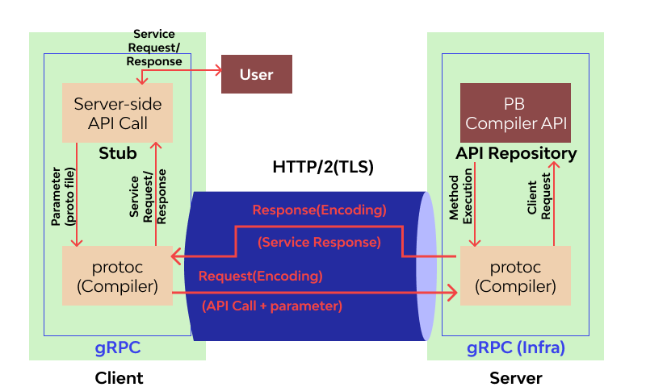

## [Tutorials](https://grpc.io/docs/languages/java/basics/)
- ### Protocol buffers
  - https://www.baeldung.com/spring-rest-api-with-protocol-buffers 
  - https://viblo.asia/p/protocol-buffers-la-gi-va-nhung-dieu-can-ban-can-biet-ve-no-maGK7D99Zj2
  - [Interface Definition Language (IDL)](https://www.freecodecamp.org/news/what-is-grpc-protocol-buffers-stream-architecture/)
    - Protobuf is the most commonly used IDL (Interface Definition Language) for gRPC. It's where you basically store your data and function contracts in the form of a proto file.
    - [gRPC uses the Interface Definition Language (IDL) from Protocol Buffers. The Protocol Buffers IDL is a custom, platform-neutral language with an open specification. Developers author .proto files to describe services, along with their inputs and outputs. These .proto files can then be used to generate language- or platform-specific stubs for clients and servers, allowing multiple different platforms to communicate. By sharing `.proto` files, teams can generate code to use each others' services, without needing to take a code dependency. One of the advantages of the Protobuf IDL is that as a custom language, it enables gRPC to be completely language and platform agnostic, not favoring any technology over another.](https://docs.microsoft.com/en-us/dotnet/architecture/grpc-for-wcf-developers/interface-definition-language)
- ### [Generate Java code from Protocol Buffers](https://dev.to/techschoolguru/config-gradle-to-generate-java-code-from-protobuf-1cla)
    
## Stories
- https://medium.com/apis-and-digital-transformation/i-got-a-golden-ticket-what-i-learned-about-apis-in-my-first-year-at-google-556e1f02f9ab

## Tools
- https://github.com/grpc-ecosystem/awesome-grpc  

----

[High-level Components](https://github.com/grpc/grpc-java/blob/master/README.md)
---------------------

At a high level there are three distinct layers to the library: *Stub*,
*Channel*, and *Transport*.

### Stub

The Stub layer is what is exposed to most developers and provides type-safe
bindings to whatever datamodel/IDL/interface you are adapting. gRPC comes with
a [plugin](https://github.com/google/grpc-java/blob/master/compiler) to the
protocol-buffers compiler that generates Stub interfaces out of `.proto` files,
but bindings to other datamodel/IDL are easy and encouraged.

### Channel

The Channel layer is an abstraction over Transport handling that is suitable for
interception/decoration and exposes more behavior to the application than the
Stub layer. It is intended to be easy for application frameworks to use this
layer to address cross-cutting concerns such as logging, monitoring, auth, etc.

### Transport

The Transport layer does the heavy lifting of putting and taking bytes off the
wire. The interfaces to it are abstract just enough to allow plugging in of
different implementations. Note the transport layer API is considered internal
to gRPC and has weaker API guarantees than the core API under package `io.grpc`.

gRPC comes with three Transport implementations:

1. The Netty-based transport is the main transport implementation based on
   [Netty](https://netty.io). It is for both the client and the server.
2. The OkHttp-based transport is a lightweight transport based on
   [OkHttp](https://square.github.io/okhttp/). It is mainly for use on Android
   and is for client only.
3. The in-process transport is for when a server is in the same process as the
   client. It is useful for testing, while also being safe for production use.

----
