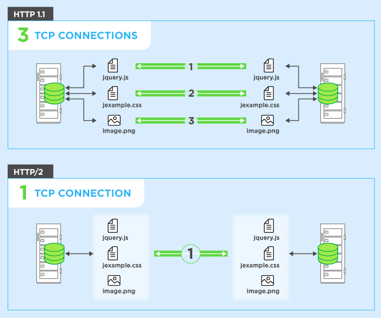
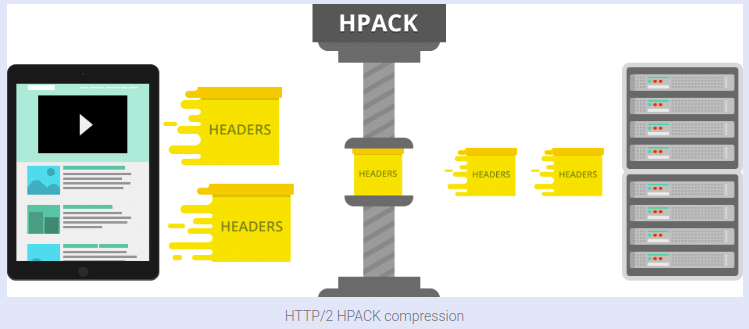
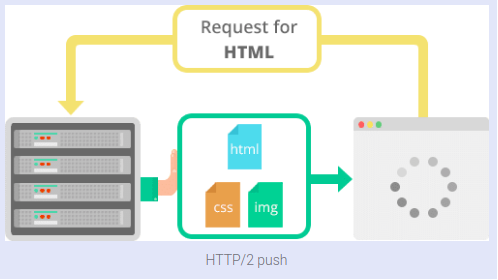

## [Tutorials](https://grpc.io/docs/languages/java/basics/)
- ### Protocol buffers
  - https://www.baeldung.com/spring-rest-api-with-protocol-buffers 
  - https://viblo.asia/p/protocol-buffers-la-gi-va-nhung-dieu-can-ban-can-biet-ve-no-maGK7D99Zj2
  - [Interface Definition Language (IDL)](https://www.freecodecamp.org/news/what-is-grpc-protocol-buffers-stream-architecture/)
    - Protobuf is the most commonly used IDL (Interface Definition Language) for gRPC. It's where you basically store your data and function contracts in the form of a proto file.
    - [gRPC uses the Interface Definition Language (IDL) from Protocol Buffers. The Protocol Buffers IDL is a custom, platform-neutral language with an open specification. Developers author .proto files to describe services, along with their inputs and outputs. These .proto files can then be used to generate language- or platform-specific stubs for clients and servers, allowing multiple different platforms to communicate. By sharing `.proto` files, teams can generate code to use each others' services, without needing to take a code dependency. One of the advantages of the Protobuf IDL is that as a custom language, it enables gRPC to be completely language and platform agnostic, not favoring any technology over another.](https://docs.microsoft.com/en-us/dotnet/architecture/grpc-for-wcf-developers/interface-definition-language)
- ### [Generate Java code from Protocol Buffers](https://dev.to/techschoolguru/config-gradle-to-generate-java-code-from-protobuf-1cla)
- ### [Dùng lý thuyết củ hành để tìm hiểu gRPC](https://www.linkedin.com/pulse/d%C3%B9ng-l%C3%BD-thuy%E1%BA%BFt-c%E1%BB%A7-h%C3%A0nh-%C4%91%E1%BB%83-t%C3%ACm-hi%E1%BB%83u-grpc-nguyen-nguyen/)
    - gRPC là một RPC platform được phát triển bởi Google nhằm tối ưu hoá và tăng tốc việc giao tiếp giữa các service với nhau trong kiến trúc microservice. gRPC dùng Protocal Buffer giảm kích thước request và response data, RPC để đơn giản hoá trong việc tạo ra các giao tiếp giữa các service với nhau, HTTP/2 để tăng tốc gửi/nhận HTTP request.
    - RPC là từ viết tắc của Remote Procedure Call, nó được xây dựng với ý tưởng là đơn giản hoá việc giao tiếp giữa những service với nhau, thay vì những service giao tiếp với nhau theo kiểu RESTful API thì giờ đơn giản là gọi hàm như những object nói chuyện với nhau thôi, còn việc phân tán các service là chuyện của tương lai không dính liếu đến việc code.
    - Protocal Buffer là một ngôn ngữ trung lập để serializing structured data sử dụng cho việc giao tiếp giữa các service với nhau. Protocal Buffer được tạo ra với ý tưởng là làm nhỏ kích thước data truyền đi trong giao tiếp và chỉ cần định nghĩa một lần và sử dụng cho các service với các ngôn ngữ lập trình khác nhau.
    - 
    - 
    - 
    - 
  
## Stories
- https://medium.com/apis-and-digital-transformation/i-got-a-golden-ticket-what-i-learned-about-apis-in-my-first-year-at-google-556e1f02f9ab

## Tools
- https://github.com/grpc-ecosystem/awesome-grpc  

- ### Wireshark analyzing GRPC message (Kiểm tra kích cỡ message sau khi serialize)
  - https://www.imlc.me/how-to-inspect-grpc-with-wireshark/
  - https://www.ridingthecrest.com/blog/2018/10/29/wireshark-getting-started.html

    ```shell
    sudo apt update -y && sudo apt install wireshark -y
    
    sudo wireshark
    
    # config http, http2 (or then decode tcp connection as http2)
    # config gRPC
    # config protobuf
    # Edit -> Preferences -> Protocols
    ```
----

[High-level Components](https://github.com/grpc/grpc-java/blob/master/README.md)
---------------------


At a high level there are three distinct layers to the library: *Stub*,
*Channel*, and *Transport*.

### Stub

The Stub layer is what is exposed to most developers and provides type-safe
bindings to whatever datamodel/IDL/interface you are adapting. gRPC comes with
a [plugin](https://github.com/google/grpc-java/blob/master/compiler) to the
protocol-buffers compiler that generates Stub interfaces out of `.proto` files,
but bindings to other datamodel/IDL are easy and encouraged.

### Channel

The Channel layer is an abstraction over Transport handling that is suitable for
interception/decoration and exposes more behavior to the application than the
Stub layer. It is intended to be easy for application frameworks to use this
layer to address cross-cutting concerns such as logging, monitoring, auth, etc.

### Transport

The Transport layer does the heavy lifting of putting and taking bytes off the
wire. The interfaces to it are abstract just enough to allow plugging in of
different implementations. Note the transport layer API is considered internal
to gRPC and has weaker API guarantees than the core API under package `io.grpc`.

gRPC comes with three Transport implementations:

1. The Netty-based transport is the main transport implementation based on
   [Netty](https://netty.io). It is for both the client and the server.
2. The OkHttp-based transport is a lightweight transport based on
   [OkHttp](https://square.github.io/okhttp/). It is mainly for use on Android
   and is for client only.
3. The in-process transport is for when a server is in the same process as the
   client. It is useful for testing, while also being safe for production use.

----

## Interface Project (Interface Definition Language- IDL)


We recommend splitting your project into 2-3 separate modules.

1. **The interface project** Contains the raw protobuf files and generates the java model and service classes. You probably share this part.
2. **The server project** Contains the actual implementation of your project and uses the interface project as dependency.
3. **The client projects** (optional and possibly many) Any client projects that use the pre-generated stubs to access the server.


## [Tutorials](https://yidongnan.github.io/grpc-spring-boot-starter/en/server/getting-started.html#interface-project)


