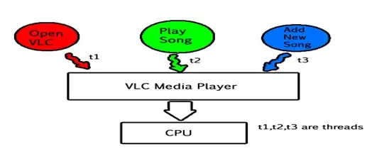
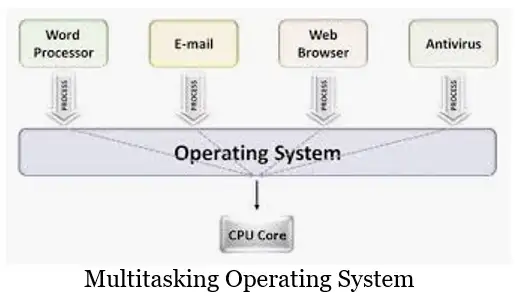

## [Multi-threading vs Concurrency](https://www.educative.io/blog/multithreading-and-concurrency-fundamentals)

> **Concurrency** is the ability of your program to deal (not doing) with many things at once and is achieved through multithreading. Do not confuse **concurrency** with **parallelism** which is about doing many things at once.

## [Does a single core CPU allow only parallel execution?](https://stackoverflow.com/questions/61608659/does-a-single-core-cpu-allow-only-parallel-execution)

> **Parallel**: Two executions at the same time. 
> 
> **Concurrent**: Two executions at interleaved times. 

## [Can any computer (multi or single core) run many threads at the same time](https://stackoverflow.com/questions/41377983/can-any-computer-multi-or-single-core-run-many-threads-at-the-same-time)

> You can create multiple threads in your environment and have a **single CPU core** execute these threads. However, their execution will not be in parallel but **merely concurrent**. In other words, the CPU will execute one thread (in part or completely) first then the other thread. If there was work left on the first thread it then may return to the first thread again and execute some more instructions. The threads are thus progressing concurrently. If the threads were executed on **more than one CPU core** then they can be executed at the same time which means they are executed in **parallel**.

> In summary, multiple threads on a single CPU core can be executed concurrently. Multiple threads on multiple CPU cores can be executed concurrently or in parallel.

## [Can having multiple threads on a single core system still improve performance?](https://stackoverflow.com/questions/43962529/can-having-multiple-threads-on-a-single-core-system-still-improve-performance)

Having multiple threads on a single CPU can improve performance in the majority of cases, because in the majority of cases a thread is not busy doing computations, it is waiting for things to happen.

This includes I/O, such as waiting for a disk operation to complete, waiting for a packet to arrive from the network, waiting for user input, etc. and even some non-I/O situations, such as waiting for a different thread to signal that an event has occurred.

So, since threads spend the vast majority of their time doing nothing but waiting, they compete against each other for the CPU far less frequently than you might think.

That's why if you look at the number of active threads in a modern desktop computer you are likely to see hundreds of threads, and if you look at a server, you are likely to see thousands of threads.  That's clearly a lot more than the number of cores that the computer has, and obviously, it would not be done if there was no benefit from it.

The only situation where multiple threads on a single core will not improve performance is when the threads are busy doing non-stop calculations.  This tends to only happen in specialized situations, like scientific computing, cryptocurrency mining, etc.

So, multiple threads on a single-core system do usually increase performance, but this has very little to do with memory, and to the extent that it does, it has nothing to do with "separated" memory.

As a matter of fact, running multiple threads (on the same core or even different cores on the same chip) that mostly access different areas of memory (and they mostly do) tends to *hurt* performance, because each time the CPU switches from one thread to the other it begins to access a different set of memory locations, which are unlikely to be in the CPU's cache, so each context switch tends to be followed by a barrage of cache misses, which represent overhead. But usually, it is still worth it.

## [Can multithreading be implemented on a single processor system?](https://stackoverflow.com/questions/16116952/can-multithreading-be-implemented-on-a-single-processor-system)

In a multithreaded process on a single processor, the processor can switch execution resources between threads, resulting in concurrent execution. Concurrency indicates that more than one thread is making progress, but the threads are not actually running simultaneously. The switching between threads happens quickly enough that the threads might appear to run simultaneously.

## [Multitasking vs multithreading](https://medium.com/@muntahashams288/difference-between-multitasking-and-multithreading-c8a3a33bc1d1)

## Maximum number of thread per process

- https://stackoverflow.com/a/67682091/10393067
- https://stackoverflow.com/questions/344203/maximum-number-of-threads-per-process-in-linux
- https://www.baeldung.com/linux/max-threads-per-process
- [Understanding the differences between pid_max, ulimit -u and thread_max](https://unix.stackexchange.com/a/136855/363633)
    > cat /proc/sys/kernel/threads-max
  >
