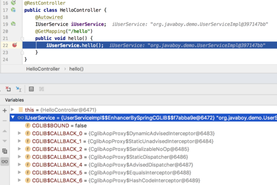
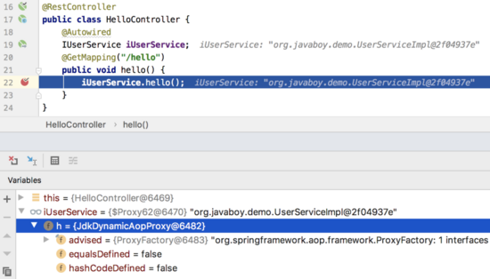
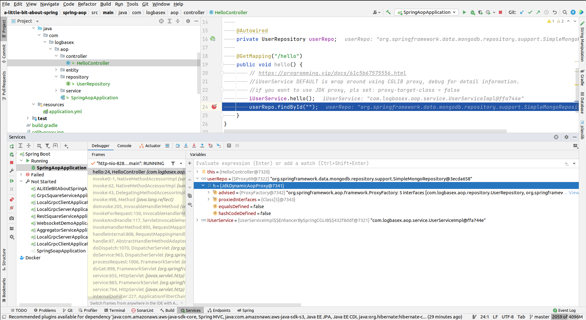
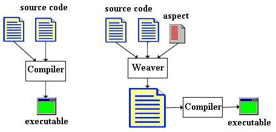

## [AOP Proxies](https://docs.spring.io/spring-framework/docs/current/reference/html/core.html#aop-introduction-proxies)
> Spring AOP defaults to using standard JDK dynamic proxies for AOP proxies. This enables any interface (or set of interfaces) to be proxied.
>
> Spring AOP can also use CGLIB proxies. This is necessary to proxy classes rather than interfaces. By default, CGLIB is used if a business object does not implement an interface. As it is good practice to program to interfaces rather than classes, business classes normally implement one or more business interfaces. It is possible to force the use of CGLIB, in those (hopefully rare) cases where you need to advise a method that is not declared on an interface or where you need to pass a proxied object to a method as a concrete type.

## Tutorials
- https://www.springcloud.io/post/2022-01/springboot-aop/#gsc.tab=0
- [In Spring AOP, does spring creates proxy object every time a target bean is created or it happens only first time?](https://stackoverflow.com/questions/47134158/in-spring-aop-does-spring-creates-proxy-object-every-time-a-target-bean-is-crea)
- 
## [When does spring AOP use JDK dynamic proxy? When to use cglib? What is the default?](https://javamana.com/2021/10/20211029042150541c.html)

> JDK dynamic proxy can apply only on interface.
>

## Weaver

