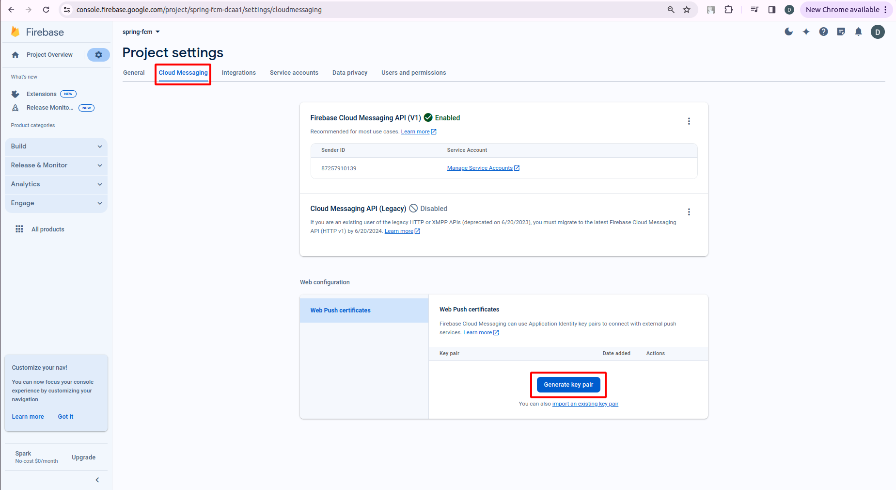

## References
- 

----
----

## Step 1. Create Project

> https://console.firebase.google.com/

## Step 2. Create web app

## Step 3. Setting web app

- **Cloud Messaging configuration** is primarily used on the client side. It involves setting up the Firebase SDK in your client application (like a web app, Android app, or iOS app) to receive messages and notifications sent through Firebase Cloud Messaging (FCM). The client uses public configuration details, such as the API key, project ID, and sender ID, which are safe to expose in client-side code.

- **Service Account configuration** is used on the server side. It involves setting up the Firebase Admin SDK in your server application (like a Spring Boot application) to interact with Firebase services securely. The server uses the Service Account's credentials (often provided as a JSON file) for authentication and authorization, allowing it to perform administrative tasks such as sending messages via FCM, accessing databases, and managing user authentication.

Here's how they typically work in a system:

- **Server-side (Service Account):**
    - The server, authenticated with a Service Account, can securely interact with Firebase services, including sending push notifications through FCM.
    - Service Account credentials are kept private and used to authorize the server application to perform operations on behalf of your Firebase project.

- **Client-side (Cloud Messaging):**
    - The client application uses the Firebase SDK initialized with Cloud Messaging configuration to listen for and handle incoming messages.
    - The public configuration details used on the client side are specifically designed for integrating Firebase services, like FCM, into your application without exposing sensitive information.

In summary, the separation of these configurations aligns with the principle of least privilege and ensures secure interaction with Firebase services: the client-side configuration allows receiving messages, while the server-side configuration with a Service Account enables broader administrative capabilities.