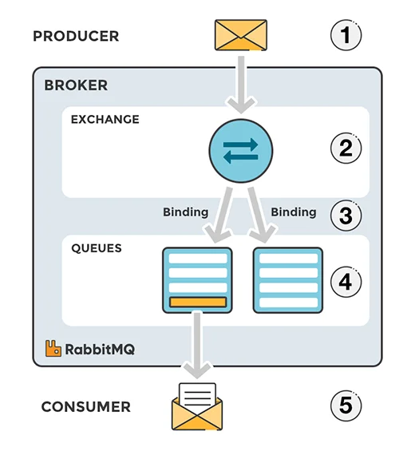
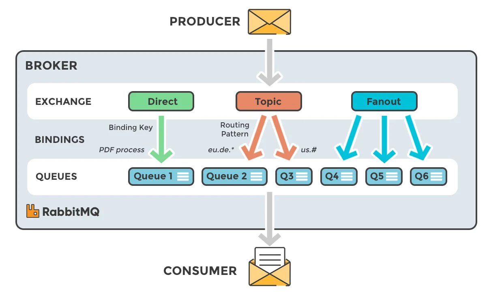
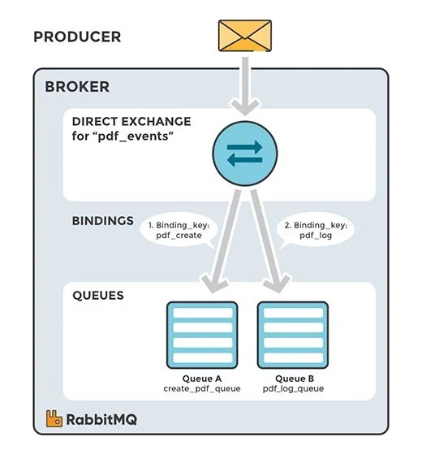
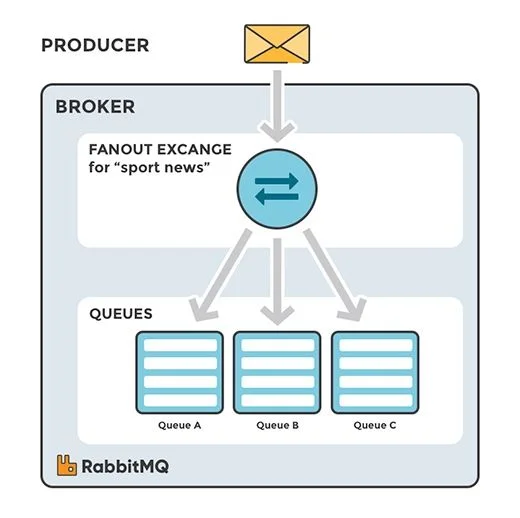
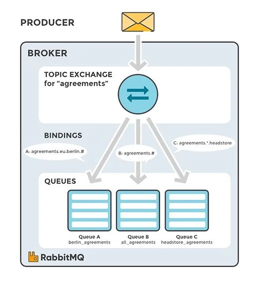
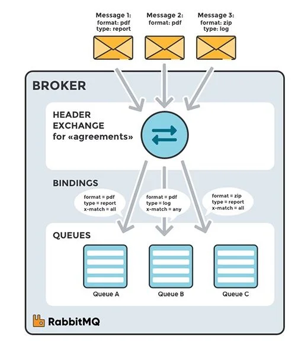

## Admin UI

> http://localhost:15672

====
====

> Có thể dùng RabbitMQ + STOMP over Websocket thay cho a standalone websocket server.
> 
> STOMP over Websocket ~ HTTP over TCP/IP

======
======

## Overview

Trong kiến trúc phần mềm hiện đại, nơi các hệ thống càng trở nên phân tán, việc giao tiếp hiệu quả giữa các thành phần trong hệ thống là điều cần thiết. **RabbitMQ** nổi lên như một giải pháp mạnh mẽ để hỗ trợ giao tiếp giữa các ứng dụng và dịch vụ khác nhau.

Trong bài viết này, chúng ta sẽ đi sâu vào thế giới của RabbitMQ, tìm hiểu định nghĩa, khám phá các thành phần cốt lõi khiến RabbitMQ hoạt động, phân tích ưu điểm, nhược điểm và các trường hợp sử dụng của nó.

## 1\. RabbitMQ là gì?

**RabbitMQ** là một **message broker** (nhà môi giới tin nhắn) mã nguồn mở viết bằng Erlang.

RabbitMQ ban đầu được phát triển với sự hợp tác giữa LShift, LTD và Cohesive FT, hiện thuộc sở hữu của Pivotal Software Inc và được phát hành vào năm 2007 theo giấy phép Mozilla Public License.

RabbitMQ là một trong những message broker đầu tiên triển khai giao thức **AMQP** (**A**dvanced **M**essage **Q**ueuing **P**rotocol).

AMQP là một giao thức mở (open protocol) truyền thông tiêu chuẩn hóa nhằm mục đích gửi message có độ tin cậy cao và hiệu quả giữa các ứng dụng và message broker. AMQP không chỉ xác định giao thức để giao tiếp với RabbitMQ mà còn xác định mô hình logic phát thảo chức năng cốt lõi của RabbitMQ.

## 2\. RabbitMQ hoạt động như nào?

Luồng message trong RabbitMQ hoạt động như sau:

1.  Producer gửi một message tới một exchange. Exchange phải được chỉ định type khi được tạo.
2.  Exchange nhận được message và chịu trách nhiệm định tuyến message. Việc trao đổi sẽ tính đến các thuộc tính của message và loại exchange, chẳng hạn như routing key.
3.  Giữa exchange và queue phải thiết lập bindings từ trước. Exchange định tuyến message vào queue tùy thuộc vào thuộc tính của message. Trong ví dụ trên, có 2 bindings từ exchange với 2 queue khác nhau.
4.  Các message vẫn ở trong queue cho đến khi chúng được consumer xử lý.
5.  Consumer xử lý message.

## 3\. Các thành phần chính trong RabbitMQ

Trong kiến trúc của RabbitMQ, các thành phần chính bao gồm **message**, **producer**, **exchange**, **bindings**, **queue** và **consumer**. Sau đây, tôi sẽ đi vào phân tích chi tiết từng thành phần.

### 3.1. Message

**Message** (tin nhắn) là đơn vị cơ bản để trao đổi thông tin trong RabbitMQ. Nó bao gồm một **body** (còn gọi là payload) và các **property** (thuộc tính) tuỳ chọn khác như header (tiêu đề), routing key (khoá định tuyến), message ID, ...

#### 3.1.1. Message Body

**Message body** chứa dữ liệu thực tế cần được gửi, có thể ở nhiều định dạng khác nhau như JSON, XML, binary hoặc bất kỳ cấu trúc nào. Nội dung của message body có thể đại diện cho các lệnh, sự kiện, thông báo hoặc bất kỳ thông tin nào cần trao đổi.

#### 3.1.2. Message Properties (Các thuộc tính của message)

**Message property** (thuộc tính của tin nhắn) bao gồm các atribute và metadata khác nhau đi kèm với message.

Dưới đây là danh sách một số property điển hình:

-   **Routing key** (Khoá định tuyến): được exchange dùng để xác định cách định tuyến message tới queue (phụ thuộc vào exchange type).
-   **Message ID**: mã định danh duy nhất xác định message.
-   **Timestamp**: thời gian khi message được tạo.
-   **Headers** (Tiêu đề): Tiêu đề tuỳ chỉnh chứa thông tin bổ sung về message.
-   **Delivery Mode** (Chế độ chuyển phát): chỉ định chế độ chuyển phát, liệu có nên lưu message vào đĩa để duy trì độ bền hay không.
-   **Expiration** (Hạn dùng): thời gian message bị loại bỏ nếu không được sử dụng.
-   **Priority** (Độ ưu tiên): mức độ ưu tiên của message.
-   **Content type** (Loại nội dung): mô tả định dạng của nội dung message (ví dụ: `application/json`).
-   **Content encoding** (Mã hoá nội dung): chỉ định kiêủ mã hoá được sử dụng cho nội dung message (ví dụ: `utf-8`).

### 3.2. Producers

**Producer** là một ứng dụng (hoặc phiên bản ứng dụng) gửi message tới RabbitMQ. Đây là điểm khởi đầu trong workflow của RabbitMQ.

Producer thường mở một hoặc nhiều kết nối TCP tới exchange trong quá trình ứng dụng khởi tạo. Các kết nối này thường tồn tại miễn là kết nối của chúng hoặc ứng dụng đang chạy (long-lived connection).

### 3.3. Bindings

**Binding** là các ràng buộc được thiết lập để xác định mối quan hệ giữa exchange và queue. Chúng chỉ định các quy tắc định tuyến để gửi message từ exchange tới queue thích hợp. Một queue có thể liên kết với nhiều exchange và một exchange có thể có nhiều liên kết tới các queue khác nhau.

### 3.4. Exchanges

Trong RabbitMQ, **exchange** (sàn giao dịch) đóng vai trò như một _bộ định tuyến message_. Khi producer gửi message tới RabbitMQ, message sẽ được gửi tới exchange. Sau đó, exchange sẽ định tuyến message đến queue thích hợp.

Các loại RabbitMQ exchange phổ biến

RabbitMQ có **5 loại exchange khác nhau** dùng để định tuyến message. Mỗi loại exchange sẽ có cách sử dụng tham số và thiết lập binding khác nhau. Client có thể tự tạo exchange hoặc sử dụng exchange mặc định khi server khởi tạo.

#### 3.4.1. Direct exchange

Trong direct exchange, message được định tuyến đến queue dựa trên routing key. Nếu routing key của message khớp với routing key của queue, message sẽ được chuyển đến queue đó. Ngược lại, nếu routing key của message không khớp với bất kỳ routing key của queue nào, message sẽ bị loại bỏ.

Direct exchange

Ở hình trên, chúng ta có

-   Exchange: `pdf_events`
-   Queue A: `create_pdf_queue`
-   Queue B: `create_log_queue`
-   Binding key giữa exchange và Queue A: `pdf_create`
-   Binding key giữa exchange và Queue B: `pdf_log`

Một message có routing key là `pdf_log` được gửi tới exchange `pdf_events`. Message này sẽ định tuyến tới queue B `pdf_log_queue` vì routing key của message trùng với binding key `pdf_log`.

#### 3.4.2. Default exchange

Default exchange là một direct exchange mặc định, được khai báo trước mà không có tên, cho phép định tuyến message trực tiếp tới queue với tên là routing key của message. Mỗi queue đều tự động liên kết với exchange mặc định bằng một routing key giống tên của queue.

#### 3.4.3. Fanout exchange

Trong fanout exchange, message được định tuyến đến tất cả các queue được liên kết với nó, bất kể chúng có routing key như nào.

Fanout exchange

Ví dụ, ở hình trên, chúng ta có

-   Exchange: `sport news`
-   Queue A
-   Queue B
-   Queue C
-   Binding: queue A, B, C có cùng binding tới exchange

Message gửi từ exchange `sport news` sẽ được định tuyến tới cả 3 queue A, B, C bất kể chúng có routing key khác nhau do chúng đều được liên kết với exchange.

#### 3.4.4. Topic exchange

Trong topic exchange, message được định tuyến đến queue dựa trên topic, cho phép sử dụng regular expression pattern trong routing key như `*` để đại diện cho một ký tự và `#` đại diện cho không hoặc nhiều ký tự.

Topic exchange

Ví dụ, ở hình trên, chúng ta có

-   Exchange: `aggreements`
-   Queue A: `berlin_agreements`
-   Queue B: `ali_agreements`
-   Queue C: `headstone_agreements`
-   Binding key giữa exchange và Queue A: `agreements.eu.berlin.#`
-   Binding key giữa exchange và Queue B: `agreements.#`
-   Binding key giữa exchange và Queue C: `agreements.*.headstone`

Message có routing key `agreements.eu.berlin` được gửi tới exchange `agreements`. Message này sẽ được định tuyến tới queue A `berlin_agreements` vì routing pattern khớp với binding key `agreements.eu.berlin.#`.

Đồng thời, message này cũng được gửi tới queue B vì khớp với binding key `agreements.#`.

#### 3.4.5. Header exchange

Trong header exchange, message được định tuyến dựa trên thuộc tính header của message thay vì routing key.

Header exchange

Ví dụ, ở hình trên, chúng ta có

-   Message 1: header có dạng `key: value` là `format: pdf`, `type: report`
-   Message 2: header có dạng `key: value` là `format: pdf`
-   Message 3: header có dạng `key: value` là `format: zip`, `type: log`
-   Exchange: `aggreements`
-   Queue A
-   Queue B
-   Queue C
-   Binding 1 giữa exchange và Queue A: có dạng `key: value` là `format: pdf`, `type: report`, `x-match: all`
-   Binding 2 giữa exchange và Queue B: có dạng `key: value` là `format: pdf`, `type: log`, `x-match: any`
-   Binding 3 giữa exchange và Queue C: có dạng `key: value` là `format: zip`, `type: report`, `x-match: all`

Tham số `x-match` trong binding xác định cách so sánh các cặp key/value của header trong message với header của binding. Có 2 giá trị cho tham số `x-match` là `any` và `all`.

1.  `x-match: any`: chỉ cần một thuộc tính trong header của message phải khớp với header của binding.
2.  `x-match: all`: tất cả các thuộc tính trong header của message phải khớp với header của binding.

Message 1 sẽ được định tuyến tới queue A vì tất cả cặp key/value trong header của message đều khớp với binding.

Message 1 sẽ được định tuyến tới queue B vì có cặp key/value `format: pdf` trùng và thuộc tính `x-match: any` yêu cầu chỉ cần một thuộc tính trong header khớp dù message 1 có `type: report` không khớp với `type: log` của binding 1.

Message 2 sẽ được định tuyến tới queue B vì khớp `format: pdf`.

Message 3 sẽ được định tuyến tới queue B vì `type: log`.

### 3.5. Queues

Trong RabbitMQ, **queue** là một danh sách các message được lưu trữ cho tới khi chúng được tiêu thụ bởi consumer.

Message được định tuyến tới queue thông qua bindings từ exchange. RabbitMQ cho phép tạo nhiều queue với các cấu hình khác nhau. Mỗi queue có một tên, ngoài ra còn có các thuộc tính tùy chọn khác như độ bền, thời gian hết hạn của message và độ dài tối đa của message.

### 3.6. Consumers

**Consumer** là một ứng dụng (hoặc phiên bản ứng dụng) nhận message từ một hay nhiều queue.

Client có thể đóng kết nối tới RabbitMQ. Khi RabbitMQ phát hiện mất kết nối, việc gửi message sẽ dừng lại.

#### 3.6.1. Chế độ hoạt động

Khi một message mới đến queue, consumer sẽ tiêu thụ message thông qua 2 cơ chế hoạt động là:

1.  Cơ chế **push**: là chế độ hoạt động mặc định, RabbitMQ sẽ push message đến consumer
2.  Cơ chế **pull**: consumer chủ động poll message từ queue

##### Cơ chế push (Basic.Consume)

Trong cơ chế **push**, RabbitMQ push (đẩy) message tới consumer bất cứ khi nào có message mới trong queue. Nhờ vậy, client nhận được dữ liệu real-time hoặc gần real-time với độ trễ thấp và phản ứng với thay đổi một cách tức thì.

Do RabbitMQ là một message broker có mục đích chính là đảm bảo rằng message được gửi đến consumer nhanh chóng và hiệu quả nhất có thể, nên push trở thành chế độ hoạt động mặc định trong RabbitMQ.

Tuy nhiên, vì RabbitMQ kiểm soát tốc độ truyền dữ liệu nên cơ chế push gặp khó khăn trong việc xử lý khi các consumer có tốc độ tiêu thụ khác nhau. Ngoài ra, cơ chế push chỉ hoạt động được khi mà kết nối bidirectional giữa client và server được thiết lập sẵn. Nếu client bị ngắt kết nối khi server push response thì có thể response sẽ bị mất.

##### Cơ chế pull (Basic.Get)

Trong chế độ pull, consumer chủ động poll message từ queue.

Consumer gửi một yêu cầu `Basic.Get` tới RabbitMQ khi nó trong trạng thái sẵn sàng xử lý message. RabbitMQ sẽ gửi lại message từ queue nếu được.

Chế độ pull thích hợp dùng cho các trường hợp consumer muốn truy xuất message theo yêu cầu thay vì liên tục được push message.

Chế độ pull có thể kém hiệu quả hơn chế độ push đặc biệt nếu tần suất polling không được điều chỉnh tốt. Nếu consumer thường xuyên polling trong khi không có message nào trong queue thì sẽ dẫn tới lãng phí tài nguyên. Nếu consumer ít polling thì có thể thời gian nhàn rỗi của nó sẽ tăng.

#### 3.6.2. Delivery acknowledgment mode (Chế độ xác nhận chuyển phát)

Consumer có thể chọn giữa 2 chế độ xác nhận chuyển phát message (**delivery acknowledgment mode**) để queue biết cách xử lý các message đã gửi cho consumer:

1.  Automatic: không yêu cầu xác nhận của consumer, còn gọi là "fire and forget"<a href="https://200lab.io/blog/rabbitmq-la-gi/#fn1" id="fnref1">[1]</a>
2.  Manual: yêu cầu xác nhận của consumer

___

1.  "Fire and forget" là một thuật ngữ thường được sử dụng trong lĩnh vực công nghệ thông tin và truyền thông để mô tả một hành động hoặc một phương thức giao tiếp mà người gửi thông điệp hoặc yêu cầu không chờ đợi một phản hồi, xác nhận hoặc kết quả từ người nhận. [↩︎](https://200lab.io/blog/rabbitmq-la-gi/#fnref1)

## 4\. Ưu điểm của RabbitMQ

### 4.1. Open source (Mã nguồn mở)

RabbitMQ dược viết bằng mã nguồn mở nên các nhà phát triển và kỹ sư trong cộng đồng RabbitMQ có thể đóng góp cải tiến và tiện ích bổ sung, đồng thời tận dụng được sự hỗ trợ tài chính của công ty Pivotal.

### 4.2. ****Lightweight** (Nhẹ)**

RabbitMQ rất nhẹ, cần ít hơn 40 MB RAM để chạy ứng dụng RabbitMQ cùng với các plugin khác như giao diện quản lý.

### 4.3. Reliability (Độ tin cậy)

RabbitMQ cung cấp độ tin cậy và khả năng mở rộng để quản lý việc phân phối message trên mạng lưới các nodes, đảm bảo rằng message được gửi theo thứ tự mong muốn và không bị thất lạc.

### 4.4. Message Prioritization (Ưu tiên tin nhắn)

RabbitMQ cho phép các message được chỉ định mức độ ưu tiên khác nhau. Điều này đảm bảo rằng các message có mức độ ưu tiên cao sẽ được xử lý trước các message có mức độ ưu tiên thấp hơn.

### 4.5. Flexibility in controlling messaging trade-offs (Tính linh hoạt trong kiểm soát cân bằng tin nhắn)

RabbitMQ cung cấp các mức QoS khác nhau như "At Most Once" (Tối đa một lần), "At Least Once" (Tối thiểu một lần) và "Exactly Once" (Đúng một lần), cho phép bạn kiểm soát sự cân bằng giữa reliability (độ tin cậy) và performance (hiệu suất).

Các message trong RabbitMQ có thể được lưu vào vào ổ đĩa, đảm bảo message không bị mất khi khởi động lại broker. Tuy nhiên, điều này có thể làm tăng chi phí I/O, ảnh hưởng tới hiệu năng. Bạn có thể chọn đánh đổi durability (độ bền) để có throughput (thông lượng) cao hơn.

RabbitMQ cung cấp sự linh hoạt trong phân phối message và tiêu thụ message thông qua việc chọn hình thức exchange phù hợp (direct, topic, fanout, headers) và chọn routing key (khoá định tuyến) phù hợp.

### 4.6. Plugins for higher-latency environments (Plugin dành cho môi trường có độ trễ cao)

Do các cấu trúc liên kết và kiến trúc mạng không giống nhau nên RabbitMQ cung cấp tính năng trao đổi message trong môi trường có cả độ trễ thấp và cao, chẳng hạn Internet. Điều này cho phép RabbitMQ được phân cụm trên cùng một mạng cục bộ và chia sẻ message thống nhất trên nhiều datacenter.

### 4.7. Flexible Language and Protocol Support (Hỗ trợ ngôn ngữ và giao thức linh hoạt)

RabbitMQ hỗ trợ chạy trên nhiều hệ điều hành và cả trên môi trường cloud, đồng thời cung cấp nhiều client libraries cho hầu hết các ngôn ngữ lập trình phổ biến. Ngoài ra, RabbitMQ còn hỗ trợ các giao thức nhắn tin khác nhau như STOMP, MQTT, ...

### 4.8. Layers of security (Nhiều lớp bảo mật)

Trong RabbitMQ có nhiều lớp bảo mật. Kết nối của client có thể được bảo mật bằng cách thực thi giao tiếp chỉ có SSL và xác thực chứng chỉ client.

Quyền truy cập của người dùng có thể được quản lý ở máy chủ ảo, cung cấp sự cô lập mức độ cao cho message và tài nguyên. Ngoài ra, quyền truy cập cấu hình, đọc từ queues (hàng đợi) và ghi vào exchanges (sàn giao dịch) được quản lý bằng regex.

## 5\. Nhược điểm của RabbitMQ

### 5.1. Learning curve (Đường cong học tập)

Việc thiết lập và định cấu hình RabbitMQ có thể phức tạp, đặc biệt đối với những người mới làm quen với khái niệm message queuing. Quản lý phù hợp đòi hỏi sự hiểu biết về các khái niệm cốt lõi trong RabbitMQ như queues, exchanges, bindings (ràng buộc), ...

### 5.2. Performance Overhead (Chi phí hiệu năng)

Mặc dù độ tin cậy của RabbitMQ là một điểm mạnh nhưng cơ chế xác nhận và lưu trữ có thể gây ra một số chi phí về hiệu năng, đặc biệt là trong các tình huống cần thông lượng cao.

### 5.3. Queues of Accumulation (Hàng đợi tích luỹ)

Nếu consumer không thể tiêu thụ kịp message dẫn tới tích lũy message trong queue. Điều này có thể gây ra tiêu tốn tài nguyên và có khả năng dẫn đến các vấn đề về hiệu suất.

### 5.4. Message Serialization (Tuần tự hoá tin nhắn)

Việc tuần tự hóa và giải tuần tự hóa các đối tượng phức tạp có thể tốn thời gian, ảnh hưởng đến hiệu suất tổng thể.

====
====

## How rabbitMQ + stomp over websocket works under the hood?

RabbitMQ with STOMP (Simple Text Oriented Messaging Protocol) over WebSocket combines several technologies to facilitate real-time, bidirectional communication between clients and servers. Here's an overview of how it works under the hood:

### 1. **RabbitMQ Basics**

RabbitMQ is a message broker that implements the Advanced Message Queuing Protocol (AMQP). It allows producers to send messages to queues, which are then consumed by consumers. Key concepts in RabbitMQ include:

- **Producer:** Sends messages to an exchange.
- **Exchange:** Routes messages to queues based on routing rules.
- **Queue:** Stores messages until they are processed by consumers.
- **Consumer:** Receives and processes messages from a queue.

### 2. **STOMP Protocol**

STOMP is a simple text-based protocol designed for working with message-oriented middleware. It provides a way to interact with message brokers like RabbitMQ using simple commands. Key STOMP commands include:

- `CONNECT`: Establishes a connection to the broker.
- `SEND`: Sends a message to a destination.
- `SUBSCRIBE`: Subscribes to a destination to receive messages.
- `UNSUBSCRIBE`: Unsubscribes from a destination.
- `DISCONNECT`: Closes the connection.

### 3. **WebSocket Protocol**

WebSocket is a protocol that provides full-duplex communication channels over a single TCP connection. It is designed to be implemented in web browsers and web servers but can be used by any client or server application.

### 4. **STOMP over WebSocket**

Combining STOMP with WebSocket allows clients to use WebSockets to connect to RabbitMQ and use STOMP for messaging. Here’s a step-by-step explanation of how this works:

1. **Client Establishes WebSocket Connection:**
    - The client initiates a WebSocket connection to a WebSocket server (usually RabbitMQ's WebSocket endpoint).
    - The WebSocket handshake is performed, upgrading the HTTP connection to a WebSocket connection.

2. **STOMP Frame Exchange:**
    - Once the WebSocket connection is established, the client sends a `CONNECT` frame over the WebSocket.
    - RabbitMQ acknowledges the connection with a `CONNECTED` frame.

3. **Sending Messages:**
    - The client sends messages using the `SEND` frame. These frames are encapsulated within WebSocket frames and sent to RabbitMQ.
    - RabbitMQ routes these messages to the appropriate exchange and then to the specified queue based on the routing rules.

4. **Subscribing to Messages:**
    - The client subscribes to a destination (queue) using the `SUBSCRIBE` frame.
    - RabbitMQ starts sending messages from the specified queue to the client. Each message is wrapped in a `MESSAGE` frame and sent over the WebSocket connection.

5. **Receiving Messages:**
    - The client receives messages as `MESSAGE` frames over the WebSocket connection.
    - The client processes these messages as needed.

6. **Unsubscribing and Disconnecting:**
    - The client can unsubscribe from a destination using the `UNSUBSCRIBE` frame.
    - The client disconnects from the WebSocket connection using the `DISCONNECT` frame.
    - RabbitMQ acknowledges the disconnection and closes the WebSocket connection.

### 5. **Flow Summary**

1. **Initialization:**
    - Client opens WebSocket connection to RabbitMQ WebSocket endpoint.
    - Performs WebSocket handshake.

2. **Connection:**
    - Client sends `CONNECT` frame via WebSocket.
    - RabbitMQ sends back `CONNECTED` frame.

3. **Message Handling:**
    - Client sends `SEND` frames for producing messages.
    - Client sends `SUBSCRIBE` frames to receive messages from queues.
    - RabbitMQ sends `MESSAGE` frames for each message in the subscribed queue.

4. **Termination:**
    - Client sends `UNSUBSCRIBE` and `DISCONNECT` frames.
    - RabbitMQ closes the WebSocket connection.

### 6. **Benefits**

- **Real-time Communication:** WebSockets allow for real-time, low-latency communication between clients and RabbitMQ.
- **Protocol Simplicity:** STOMP's simple text-based protocol is easy to implement and debug.
- **Browser Support:** WebSockets are supported by modern web browsers, making it easy to build web-based real-time applications.

> In the context of STOMP over WebSocket, a frame is a basic unit of communication between the client and the server (RabbitMQ in this case). A frame in STOMP is a block of data that consists of several parts: a command, a set of headers, and an optional body.

====
====

## What if RabbitMQ without Exchange or Queue or both? Reason about that?

Certainly! Let's explore more deeply the challenges and illustrate these with concrete examples to better understand the impact of not having exchanges or queues in a messaging system like RabbitMQ.

### Challenges Without Exchanges

#### 1. **Hard-coded Routing**

**Challenge**:
Without exchanges, producers must know the exact queue to send messages to, embedding routing logic directly into the application. This increases complexity and reduces flexibility.

**Example**:
Imagine a customer support system where different types of support requests (e.g., technical issues, billing questions, general inquiries) need to be routed to different teams.

**With Exchanges**:
- A producer sends a message to an exchange with a routing key indicating the type of support request (e.g., "support.technical", "support.billing").
- The exchange routes the message to the appropriate queue based on the routing key.
- Consumers (support teams) process messages from their respective queues.

**Without Exchanges**:
- The producer must include logic to determine the correct queue for each type of support request.
- Any change in the routing logic requires changes in the producer code.
- Adding a new type of support request or changing routing rules becomes cumbersome and error-prone.

#### 2. **Limited Flexibility**

**Challenge**:
Dynamic routing, such as broadcasting messages to multiple queues or routing based on complex criteria, becomes difficult to implement.

**Example**:
Consider a notification system that needs to send alerts to multiple services (e.g., logging service, monitoring service, alerting service).

**With Exchanges**:
- A producer sends a message to a fanout exchange.
- The exchange broadcasts the message to all bound queues.
- Each service processes the message from its respective queue.

**Without Exchanges**:
- The producer must send multiple messages, one to each service’s queue.
- If a new service is added, the producer code must be updated to send messages to the new service.

### Challenges Without Queues

#### 1. **No Message Buffering**

**Challenge**:
Without queues, messages must be delivered directly from producers to consumers in real-time. If a consumer is busy or unavailable, the message is lost.

**Example**:
An e-commerce platform processes orders received from customers.

**With Queues**:
- Orders are placed into a queue.
- Consumers (order processing systems) read and process orders from the queue.
- If a consumer is temporarily unavailable, orders remain in the queue until processed.

**Without Queues**:
- Producers (web servers) must wait for order processing systems to acknowledge each order.
- If an order processing system is busy, the producer might time out or drop the order, resulting in lost orders.

#### 2. **Synchronous Processing Only**

**Challenge**:
Producers must wait for consumers to process messages, leading to blocking operations and reduced throughput.

**Example**:
A sensor network collects data from various sensors and sends it to a central processing unit for analysis.

**With Queues**:
- Sensor data is placed into a queue.
- The central processing unit reads and processes data asynchronously, allowing sensors to continue collecting and sending data without delay.

**Without Queues**:
- Sensors must wait for the central processing unit to acknowledge each piece of data.
- Any delay in processing blocks the sensors, reducing the overall data collection rate.

#### 3. **Lack of Load Balancing**

**Challenge**:
Without queues, it is difficult to distribute the load evenly across multiple consumers.

**Example**:
A video streaming service encodes videos uploaded by users.

**With Queues**:
- Uploaded videos are placed into a queue.
- Multiple encoding servers read and process videos from the queue, balancing the load evenly.

**Without Queues**:
- Each encoding server must be explicitly managed by the producer.
- If one server is overloaded while others are idle, the system cannot efficiently balance the workload.

### Challenges Without Both Exchanges and Queues

#### 1. **Direct Producer-Consumer Communication**

**Challenge**:
Messages must be sent directly from producers to consumers without any intermediaries.

**Example**:
A financial trading platform processes trade orders from multiple clients.

**With Exchanges and Queues**:
- Trade orders are sent to an exchange that routes them to appropriate queues based on trading type (e.g., stocks, bonds).
- Multiple consumers (trading engines) read and process orders from their respective queues.

**Without Exchanges and Queues**:
- Each client must send orders directly to specific trading engines.
- Any changes in trading logic or engine availability require updates to the client’s code.

#### 2. **Increased Implementation Complexity**

**Challenge**:
Developers must implement complex routing and load-balancing logic within their applications.

**Example**:
A social media platform processes posts, comments, and likes from users.

**With Exchanges and Queues**:
- Posts, comments, and likes are routed through exchanges to different queues.
- Consumers (processing services) handle each type of message from its respective queue.

**Without Exchanges and Queues**:
- The client application must manage routing and load balancing for posts, comments, and likes.
- Any change in processing logic requires significant updates to the client application.

### Practical Impact Examples

#### Scenario 1: Real-Time Communication System

**With Exchanges and Queues**:
- Messages are routed to different channels (e.g., user messages, system notifications) via exchanges.
- Queues buffer messages, allowing users to receive them even if they are temporarily offline.

**Without Exchanges and Queues**:
- The system must handle direct communication between users, requiring each user to know the exact endpoint of every other user.
- Offline messages are lost, and the system struggles to manage dynamic user availability.

#### Scenario 2: E-Commerce Order Processing

**With Exchanges and Queues**:
- Orders are routed to different queues based on priority (e.g., express orders, standard orders).
- Queues ensure that all orders are processed even if the system experiences temporary downtime.

**Without Exchanges and Queues**:
- The order management system must directly handle all routing and processing, increasing complexity.
- Any downtime results in lost orders and dissatisfied customers.

### Conclusion

Without exchanges and queues, a messaging system like RabbitMQ would face significant operational challenges, including:

- **Hard-coded Routing**: Increased complexity and reduced flexibility in message routing.
- **No Message Buffering**: Loss of messages and reduced reliability.
- **Synchronous Processing**: Blocking operations leading to reduced throughput.
- **No Load Balancing**: Inefficient distribution of work.
- **Increased Implementation Complexity**: Higher maintenance burden and potential for errors.

These challenges highlight the essential role that exchanges and queues play in enabling robust, scalable, and flexible messaging systems.