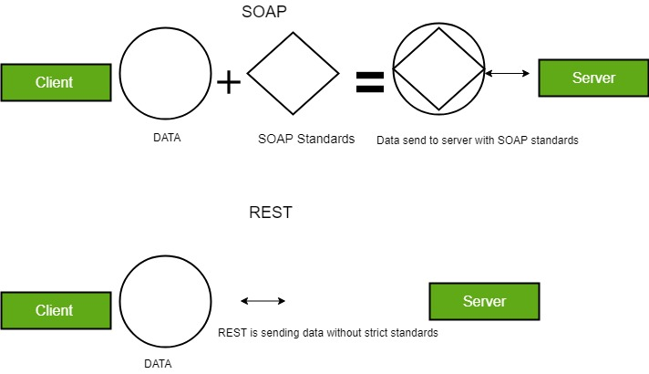
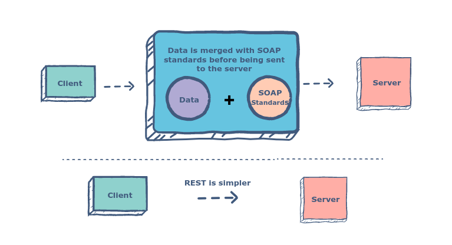
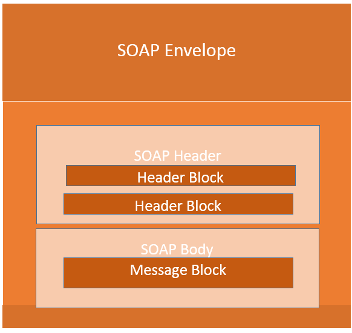
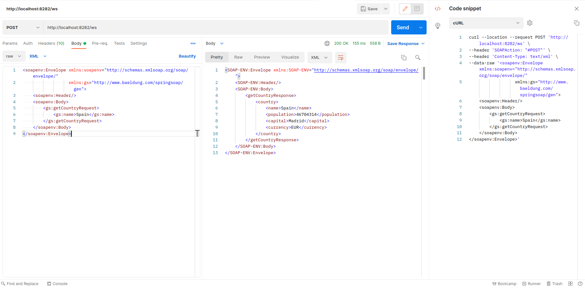

## Tutorials
- https://www.baeldung.com/spring-boot-soap-web-service
- https://www.javainuse.com/spring/springbootsoapwebservice
- https://www.guru99.com/soap-simple-object-access-protocol.html

## Postman SOAP requests
- https://learning.postman.com/docs/sending-requests/soap/making-soap-requests/






XSD : XML Schema Definition.

XML : eXtensible Markup Language.
[SOAP XML](https://www.w3schools.com/xml/xml_wsdl.asp)

WSDL : Web Service Definition Language.

Call SOAP API.



```shell
SOAP namespace: https://docs.oracle.com/cd/E19717-01/819-7757/aeqfk/index.html

curl --location --request POST 'http://localhost:8282/ws' \
--header 'SOAPAction: "#POST"' \
--header 'Content-Type: text/xml' \
--data-raw '<soapenv:Envelope xmlns:soapenv="http://schemas.xmlsoap.org/soap/envelope/"
                  xmlns:gs="http://www.baeldung.com/springsoap/gen">
    <soapenv:Header/>
    <soapenv:Body>
        <gs:getCountryRequest>
            <gs:name>Spain</gs:name>
        </gs:getCountryRequest>
    </soapenv:Body>
</soapenv:Envelope>'

<gs:..> is gs in <xmlns:gs>, gs is an alias for namespace: http://www.baeldung.com/springsoap/gen 
xmlns: xml namespace
```



## SOAP vs REST
- [Compare](https://webkul.com/blog/soap-v-s-rest/)
- [Detail compare](https://octoperf.com/blog/2018/03/26/soap-vs-rest/#conclusion)
- [Transaction and two-phase commit](https://www.facebook.com/notes/646791706259335/)
- [Rest & Soap transactional capability](https://stackoverflow.com/questions/31176102/rest-soap-transactional-capability)

> [Critique on SOAP](https://www.soapui.org/learn/api/soap-vs-rest-api/)
> 
> While the WSDL may seem like a great thing at first – it is self documenting and contains almost the complete picture of everything that is required to integrate with a service – it can also become a burden.
>
> Remember, the WSDL is a contract between you (the provider of the service) and every single one of your customers (consumers of the service).
>
> WSDL changes also means client changes.
If you want to make a change to your API, even something as small as adding an optional parameter, the WSDL must change. And WSDL changes also means client changes - all your consumers must recompile their client application against this new WSDL.
> 
> This small change greatly increases the burden on the development teams (on both sides of the communication) as well as the test teams. For this reason, the WSDL is viewed as a version lock-in, and most providers are very resistant to updating their API.