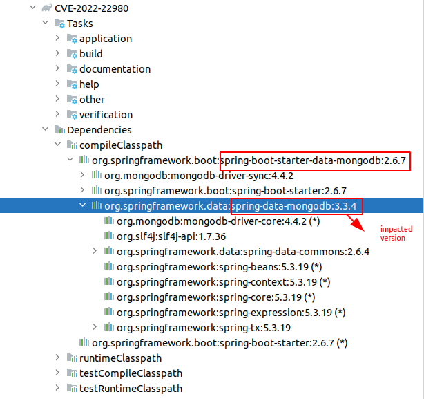

## [CVE-2022-22980: Spring Data MongoDB SpEL Expression injection vulnerability through annotated repository query methods](https://tanzu.vmware.com/security/cve-2022-22980)

## Tutorials
- https://github.com/trganda/CVE-2022-22980

