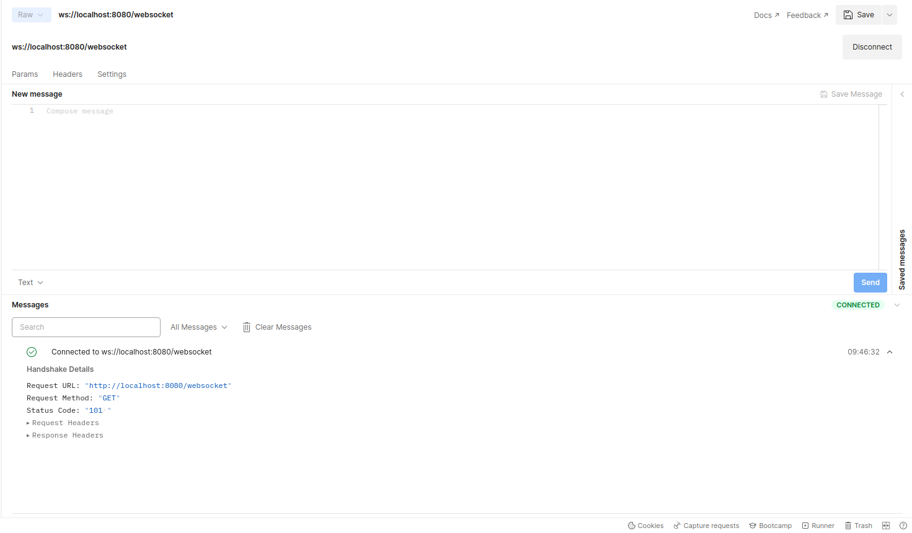

## References
- [Spring Boot 3 - WebSockets Intro and test with Postman.](https://www.youtube.com/watch?v=Smkbp5gsOiU)

---
---

## Postman

```shell
ws://localhost:8080/websocket
```



## UI

```shell
http://localhost:8080/index.html
```