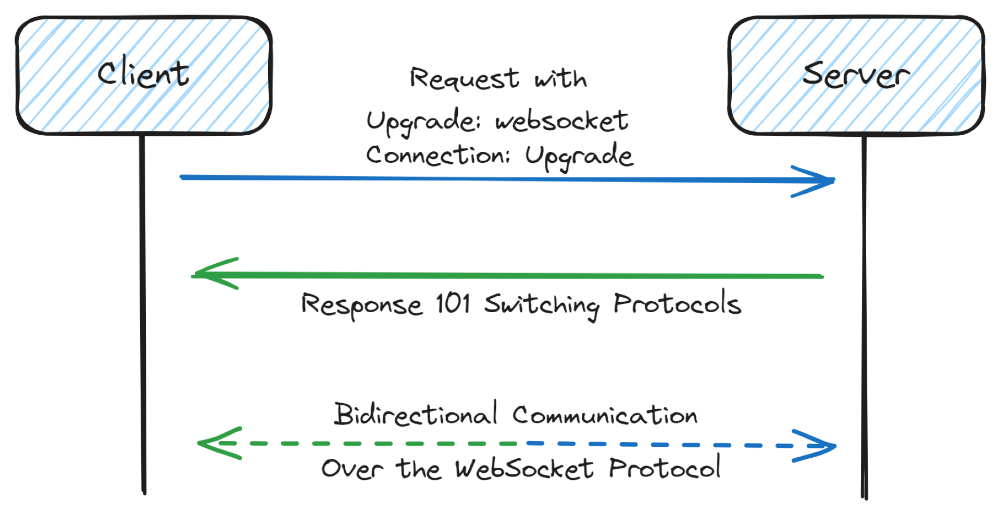
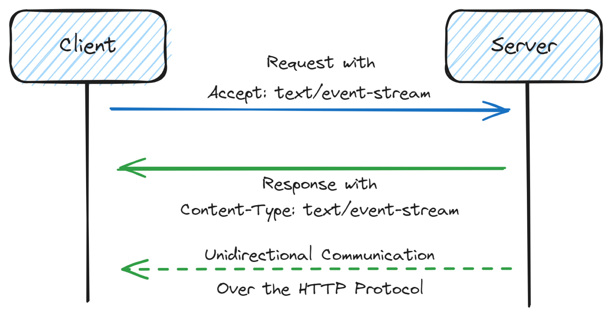

## References
- https://soubiran.dev/posts/real-time-without-websocket
- [Using SSE Instead Of WebSockets For Unidirectional Data Flow Over HTTP/2](https://www.smashingmagazine.com/2018/02/sse-websockets-data-flow-http2/)
- [What are some best practices for optimizing the performance and scalability of server sent events?](https://www.linkedin.com/advice/0/what-some-best-practices-optimizing-performance-scalability)

---
---

### Websocket

WebSocket is not HTTP. WebSocket is a protocol on its own. This is very important to know because this has consequences on how we can use it.

First, WebSocket is not native on Node.js. We have to use an external library to use it. This could become a big deal if we have to integrate it into a complex project.

Second, WebSocket does not handle reconnection. If the connection is lost, there is no built-in mechanism to reconnect. We have to handle it ourselves. In another way and despite its native support in browsers, we have to use it with a library to handle reconnection. This starts to be a lot of complexity and code to maintain.

Finally, WebSocket is not HTTP, and in your web server, you will need to handle two protocols and create a bridge between them. The bigger part is about authentication and authorization. This could result in a lot of logic to create and maintain despite the fact that we could already have an authentication logic for HTTP. This also implies having a custom logic on the client to handle authentication and authorization. This is because HTTP is stateless and WebSocket is not.

The thing I would love to hear when I was starting with WebSocket is that not every data needs to be real-time and simpler things are better than nothing.

---

### Server-Sent-Events

====
====

> [So when would you prefer SSE? Does SSE scale more easily?](https://www.reddit.com/r/learnprogramming/comments/1ah7fya/comment/koqpexb/?utm_source=share&utm_medium=web3x&utm_name=web3xcss&utm_term=1&utm_content=share_button)
> 
> Personally, I don't have strong opinion here when it comes to unidirectional approach. Regarding scaling complexity - you will solve the same problems with both: dealing with many connections and reconnections, ping-pong, open file descriptor limits, ephemeral port exhaustion, eventually adding PUB/SUB layer to scale over different machines. Ping-Pong is simpler to do with bidirectional connection btw. I've read one article before that SSE is better for mobile device battery, but to be honest I have not seen enough proofs, and have seen apps that used WebSocket without any complains about affecting battery a lot. Probably SSE may be considered from this perspective.

Server-Sent Events (SSE) and WebSockets are both used to establish real-time, live connections between a client and a server, but they serve slightly different purposes and have different operational characteristics.

Here are some reasons to prefer SSE over WebSockets:

1. **Unidirectional data flow**: If your application requires only server-to-client communication, SSE is simpler and more efficient. It's designed for unidirectional data flow, making it a good fit for applications like live news feeds, stock price updates, or any scenario where the server needs to push updates to the client.

2. **HTTP-based**: SSE operates over standard HTTP. This can lead to easier setup and compatibility with existing web infrastructure like proxies, firewalls, and load balancers, which often handle HTTP traffic more efficiently.

3. **Built-in reconnection and event ID**: SSE has built-in support for automatic reconnection and event IDs. This can make handling disconnections and maintaining the state of the stream simpler compared to WebSockets.

4. **Efficiency for certain applications**: Regarding the claim about battery efficiency on mobile devices, SSE can be more efficient in cases where the communication is predominantly from server to client. Since SSE uses a single HTTP connection that's kept open, it could potentially use fewer resources than a WebSocket connection, which is bidirectional and involves more overhead for maintaining the two-way channel, even when only one-way communication is needed.

However, the choice between SSE and WebSockets depends on the specific needs of your application. SSE does indeed have some scalability considerations similar to WebSockets, like handling large numbers of connections, dealing with network issues, and managing resource limits. Both technologies might require additional infrastructure, like a PUB/SUB layer, to scale across multiple machines and handle large-scale messaging efficiently.

In summary, while both SSE and WebSockets have their place in real-time web applications, SSE can be preferred for simpler, unidirectional data flow scenarios, especially when taking advantage of existing HTTP infrastructure. However, in terms of raw scalability and versatility, especially for bidirectional communication, WebSockets might still be the better choice.

====
====

## Does SSE rely on HTTP polling?

Server-Sent Events (SSE) does not use polling in the traditional sense where the client periodically sends requests to the server to check for updates. Instead, SSE establishes a one-way, long-lived connection from the server to the client through which the server can push updates as they occur, in real-time.

Here's how SSE works:

1. **Establishing a connection:** The client (usually a web browser) initiates the connection by sending a standard HTTP request to the server. This request asks the server to start an SSE stream.

2. **Keeping the connection open:** The server accepts this request and keeps the connection open instead of closing it after sending a response. This allows the server to send data to the client at any time without the client having to request it again.

3. **Sending data:** Whenever there is new data available, the server sends this data over the open connection in the form of an "event." These events can be sent whenever needed, without waiting for the client to ask for them.

4. **Reconnection mechanism:** If the connection between the client and server is lost (for example, due to network issues), the client will automatically attempt to reconnect to the server after a certain timeout period. This reconnection behavior is built into the SSE mechanism and differs from traditional polling where the client constantly requests data at regular intervals.

In summary, SSE is designed to provide a more efficient, real-time communication channel between the server and client compared to traditional polling methods. It eliminates the need for repeated requests from the client, reducing network overhead and allowing for the immediate push of updates from the server to the client.

====
====

## What is SSE heartbeats?

Server-Sent Events (SSE) heartbeats are a mechanism used to keep the connection between the server and the client alive. Due to the nature of some network infrastructures, idle connections—that is, connections where no data is being transferred for a certain period—might be closed by intermediaries like proxies, firewalls, or routers. To prevent this, heartbeats are used.

A heartbeat in the context of SSE is a small, often empty message that the server sends to the client at regular intervals. These messages serve to ensure that the connection remains active and open, even when there are no actual data updates to send. The regular transmission of heartbeats helps to prevent the connection from being automatically closed due to inactivity.

Here's how SSE heartbeats work:

1. **Regular transmission:** The server sends a predefined, often empty message or comment line at regular intervals (e.g., every 15, 30 seconds, or any other interval suitable for the application's requirements).

2. **Maintaining the connection:** These heartbeat messages keep the network path active, ensuring that intermediate network devices recognize the connection as active and thus keep it open.

3. **Client handling:** The client, which in the case of SSE is usually a web browser or a JavaScript application, receives these heartbeat messages. Typically, these messages are ignored by the client in terms of business logic, as they contain no meaningful data, but they are essential for maintaining the connection's liveness.

4. **Error handling and reconnection:** If the heartbeat or any other message fails to be received after a certain timeout period, the client can assume the connection has been closed and can automatically attempt to re-establish the connection.

By implementing heartbeats, SSE can maintain a persistent, reliable connection, ensuring that real-time communication is not interrupted due to network infrastructure behavior.

====
====

## Explain websocket heartbeats?

WebSocket heartbeats are a mechanism used to ensure that the connection between the client and the server is still alive and to detect any potential issues like network failures or unresponsive peers. Here's how WebSocket heartbeats work:

1. **Ping/Pong Frames**:
    - WebSocket protocol defines special control frames called "ping" and "pong."
    - A "ping" frame is sent by one party (either the client or the server) to check if the connection is still alive and working.
    - The recipient of the "ping" frame must respond with a "pong" frame as soon as possible.

2. **Detecting Connection Issues**:
    - Regular exchange of ping/pong frames helps in detecting connections that have become unresponsive or have been closed unexpectedly (for example, due to network issues).
    - If a "ping" frame is sent and no "pong" frame is received in return within a reasonable timeframe, the sender can assume that the connection has been lost and may choose to close the connection or attempt to re-establish it.

3. **Maintaining the Connection**:
    - Heartbeats are particularly useful for maintaining connections over networks that may close idle connections. Some network devices or proxies might terminate a connection if they detect no activity for a certain period.
    - By periodically sending ping/pong frames, the WebSocket connection is kept active, preventing such intermediaries from considering the connection as idle and closing it.

4. **Minimal Overhead**:
    - Ping and pong frames are designed to be lightweight and carry minimal overhead. They usually contain a small amount of control data, enough to keep the connection alive and verify its functionality without consuming significant network resources.

5. **Implementation**:
    - Many WebSocket implementations provide automatic handling of heartbeats, with configurable intervals for sending ping frames and timeouts for awaiting pong responses.
    - In custom implementations, developers need to ensure that heartbeats are managed properly to maintain connection stability and performance.

Heartbeats in WebSockets, therefore, serve as a crucial mechanism for maintaining the health and responsiveness of the real-time, persistent connection that WebSockets provide, enabling reliable and efficient two-way communication between the client and the server.

----

## What is frame here?

In the context of WebSockets, a "frame" refers to the basic unit of communication in the WebSocket protocol. Each piece of data sent over a WebSocket connection is broken down into one or more frames. These frames encapsulate the data being transmitted, allowing for efficient and structured communication between the client and the server.

### Characteristics of WebSocket Frames

1. **Structure**: A WebSocket frame consists of a header and a payload. The header contains control information, such as the type of frame (e.g., text, binary, ping, pong, close), length of the payload, and whether the data is fragmented or final. The payload is the actual data being transmitted.

2. **Types of Frames**: WebSocket frames can be of various types, including:
   - **Data Frames**: Carry the payload data that is being transmitted between the client and server. Data frames can be text (UTF-8 encoded data) or binary.
   - **Control Frames**: Used for managing the connection itself, including ping, pong, and close frames. These are used to perform tasks like checking the connection’s health (ping/pong) or signaling the closing of the connection.

3. **Fragmentation**: Large messages can be broken down into multiple frames, a process known as fragmentation. This allows the sending of a large message in smaller, manageable units without needing to buffer the entire message in memory.

4. **Order and Reliability**: Frames are sent and received in the order they are generated, ensuring that the data integrity and sequence are maintained, which is crucial for consistent communication.

5. **Efficiency**: By using frames, the WebSocket protocol minimizes the overhead of communication, making it more efficient than other, more verbose protocols (like HTTP polling), especially for real-time interactions.

### Purpose of Framing in WebSockets

- **Real-time Communication**: Enables efficient and timely transmission of data, allowing for real-time interactions between the client and server.
- **Protocol Control**: Through control frames, the protocol can manage the state of the connection, perform health checks, and gracefully handle closing the connection.
- **Flexibility**: Supports different data types and allows for message fragmentation, providing flexibility in handling various communication patterns and data sizes.

In summary, a frame in the WebSocket protocol is the fundamental unit of data transmission, designed to efficiently and reliably carry information between communicating parties in a real-time, persistent connection.

====
====

## [Why is EventSource connection closed every 30-60 sec when no data transported, while WebSocket's one is kept open?](https://stackoverflow.com/questions/8761025/why-is-eventsource-connection-closed-every-30-60-sec-when-no-data-transported-w)

> ### The Server-Sent Events (Eventsource) API is layered on HTTP. WebSocket is layered on TCP (but has an HTTP compatible handshake).? 

Both HTTP and TCP often have idle timeouts however, the TCP timeouts tend to be much longer (e.g. 2 hours rather than 2 minutes). So you still might need keep-alive messages in WebSockets, but they could probably be much less frequent. Also, the [WebSocket standard](https://www.rfc-editor.org/rfc/rfc6455) defines ping/pong frames that the browser/server may implement to do this for you.
> There is nothing as TCP idle timeout. Some firewalls might cut idle connections unless TCP is configured to send keepalive packets (which it often is), but TCP itself never closes an idle conneciton. HTTP servers generally close the HTTP connection in order to save resources. – 

====
====

## [WebSockets ping/pong, why not TCP keepalive?](https://stackoverflow.com/questions/23238319/websockets-ping-pong-why-not-tcp-keepalive)

> TCP keepalive doesn't get passed through a web proxy. The websocket ping/pong will be forwarded by through web proxies. TCP keepalive is designed to supervise a connection between TCP endpoints. Web socket endpoints are not equal to TCP endpoints. A websocket connection can use several TCP connections between two websocket endpoints.

TCP keepalive does exist and can be a good transport layer mechanism to detect inactive connections. However, WebSockets introduce some limitations with relying solely on TCP keepalive:

* **Default Disabled:** TCP Keepalive is often disabled by default on many systems.
* **Coarse-grained Checks:**  The default intervals for TCP keepalive checks can be quite long (around 2 hours) which isn't ideal for real-time applications that WebSockets are often used for.
* **Limited Scope:** TCP Keepalive only checks between TCP stacks, not necessarily verifying if the application on the other end is alive.

WebSockets ping/pong offers several advantages:

* **End-to-End Checks:**  These messages ensure both the connection and the application at the other end are responsive.
* **Customizable Frequency:**  Ping messages can be sent at intervals appropriate for the application's needs, providing a more fine-grained approach to monitoring the connection.
* **Always Available:** Since WebSockets rely on TCP, using ping/pong is inherently available.

In essence, WebSockets ping/pong provide a more application-specific and configurable way to monitor connection health compared to the general purpose TCP keepalive mechanism.

====
====

##  Why SSE has a limit on concurrent connections to a single domain?

> [Why does your browser limit the number of concurrent network calls?](https://www.linkedin.com/pulse/why-does-your-browser-limit-number-concurrent-ishwar-rimal/)

There are two main reasons why SSE has a limit on concurrent connections to a single domain:

1. **Browser Limitation on HTTP Connections:**
   - Traditionally, browsers enforce a limit on the number of open HTTP connections (typically 6) to a single domain. This is done to prevent overwhelming the browser and the server with too many requests at once.
   - Each SSE connection requires its own dedicated HTTP connection to keep the data stream open. With too many connections, the browser can become overloaded and unresponsive.

2. **SSE and HTTP (vs. HTTP/2):**
   - SSE relies on HTTP protocol, specifically HTTP 1.1 in most cases.
   - HTTP 1.1 has limitations on how many connections can be open at once.
   - Newer protocols like HTTP/2 allow for many more concurrent connections, but  SSE itself doesn't inherently benefit from this improvement.
   - While some servers might be using HTTP/2, it doesn't guarantee that SSE connections will leverage it for increased connections.

In short, the limit is a combination of browser restrictions on HTTP connections in general and the way SSE utilizes those connections under HTTP 1.1.
